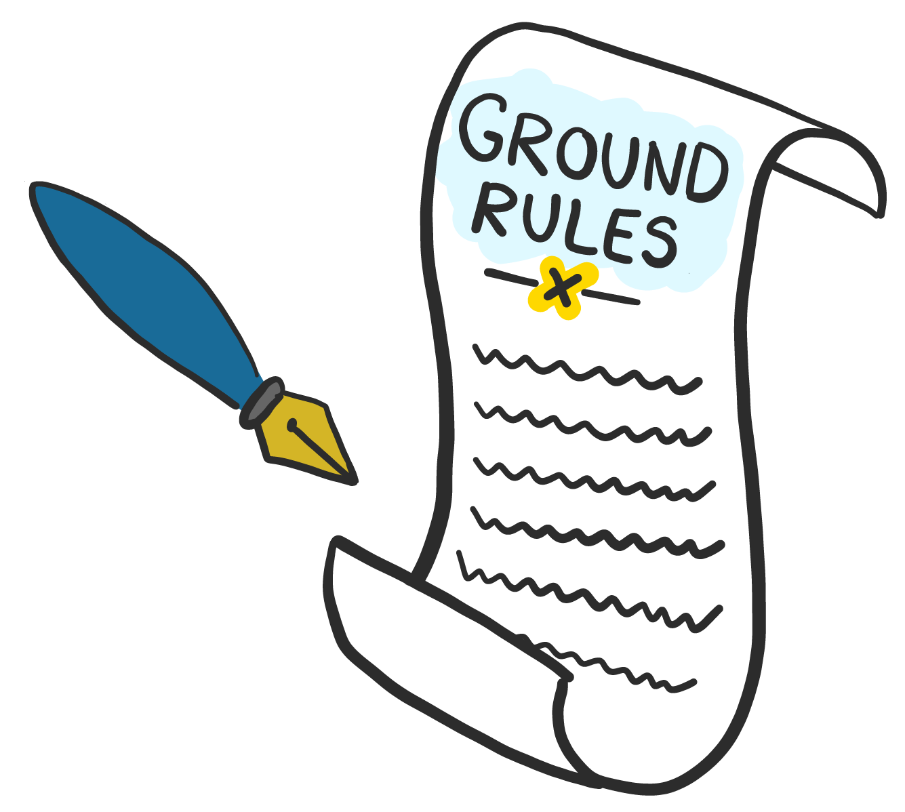

# Team Charter

## Team Charter

We use lightweight team charters to remind ourselves of the standards and principles we agree to work towards, to use as a baseline for reviewing and optimising our performance and to share knowledge when onboarding people. These become particularly important in the remote-working environment, as a failure to set expectations upfront makes it easy to slip into miscommunication and misalignment. Ease the communication within your team by helping your team members set their expectations and understand their responsibilities.

Areas that we suggest you consider for your team charter include:

* Team-specific principles
* What are our regular ceremonies?
* How we will make decisions as a team?
* How we will collaborate as a team?
* How we will plan and prioritise our work?

The information below will help **shape the extra, remote working items** that should be considered for your charter.

[Click here to jump to the google doc](https://docs.google.com/document/d/1Mes31wb_kB9bnBnkKPDDzBMPDj5ibVbxOWZCOrE4Ia8/edit?usp=sharing).



