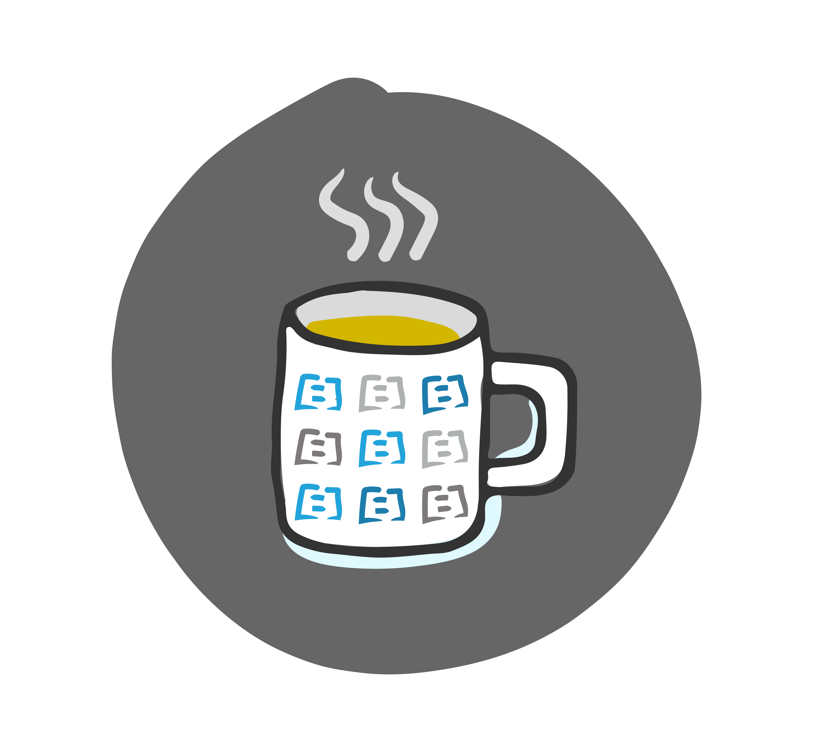

# Slack

## Remote Teams and Slack

Teams that work remotely love using a real-time collaboration tool like Slack. 💛 Slack is so useful that it can be used to help a remote team manage many aspects of their process and work in real time:

* Managing Environments Incidents & Events \(production and non-production\)
* Publishing calendar events such as on-call rota’s and holidays
* Publishing Environment Build activity
* Exchanging important context and information about a project, user stories and lines of code.
* Sharing meeting notes, actions and decisions.

Perhaps one of Slack’s most useful functions is its ability to be an online version of the watercooler — where random work discussions happen mixed in with a bit of banter and a healthy dose of /giphy to express how you really feel.

The best part of Slack as a watercooler is that everyone, regardless of location, can join in or catch up with conversations that have happened as if the conversation were at the actual watercooler so others don’t miss the critical context. Slack has an excellent search tool that makes it easy to find relevant information posted in the past.

Slack is so ubiquitous that it is tempting to use it for everything! We have found that using Slack to record information which has a long shelf-life \(capturing decisions, managing updates to important design artefacts, onboarding information for new team members\) does have its drawbacks. Remember that the free version of Slack has a messaging limit and that the essential doc you shared last month may disappear in your channel message history. Some teams use plug-ins or virtual team assistants like [https://stratejos.ai/](https://stratejos.ai/) to help them manage Slack and integration with other tools.

