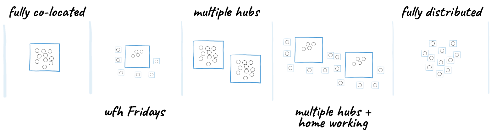
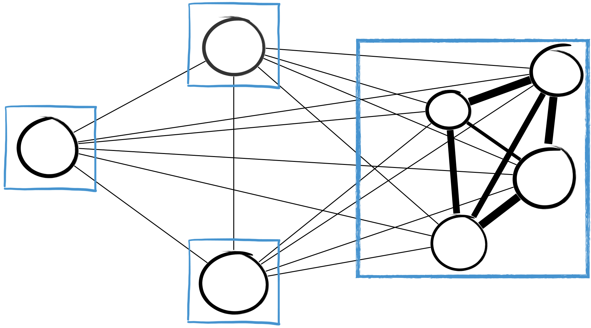
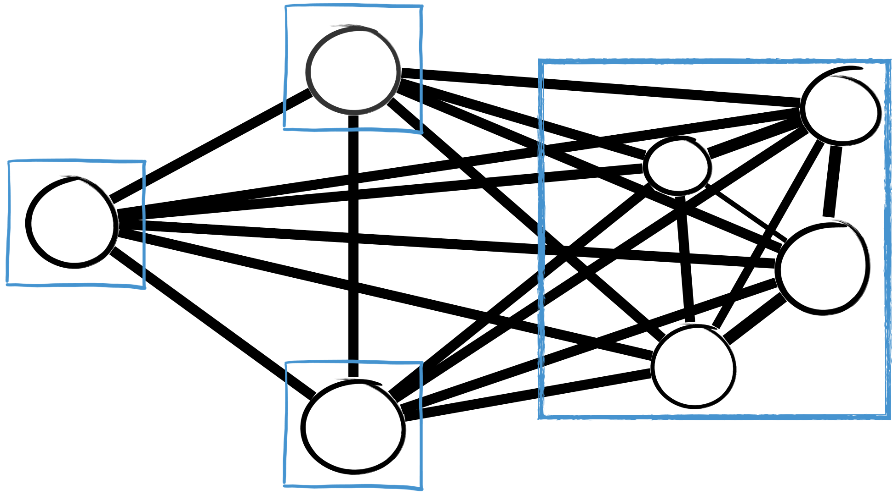

# Introduction

At Equal Experts, we often work as co-located teams; however, this isn’t always the case. We have seen a variety of arrangements from a single hub location with work-from-home Fridays to multiple hub locations spread across geographies and different time zones to fully distributed teams.

The ideas set out below aim to create conditions that allow for teams to be **highly collaborative in a remote setting**. They explain **how to increase the connection strength between each node** to achieve a point where there is clear **common ground** across the team that isn’t dependent on physical \(or temporal\) proximity.

From this \(remote-friendly\) 

To this … \(remote-first\)

## Remote-friendly vs. Remote-first

There is a real difference between operating as remote-friendly vs. remote-first.  Make it clear as a team what you want to be as it impacts the actions you need to take.  This playbook focus on the actions required to be remote-first. 

[Remote-friendly](https://doist.com/blog/remote-career-advice/): Your company may allow you to work remotely. But, most of your company’s processes, tools, and meetings will revolve around the office. As a result, remote teammates often feel excluded from important meetings and company decisions, even if that’s not the intention. 

[Remote-first](https://doist.com/blog/remote-career-advice/): Remote-first empowers team members to work remotely, make decisions online and has an individual’s videos on, even if most people are in the same room. Tools, ways of working and processes, level the communication playing field providing equal opportunities to contribute ideas and access information.

_Source amended from:_ https://doist.com/blog/remote-career-advice/

