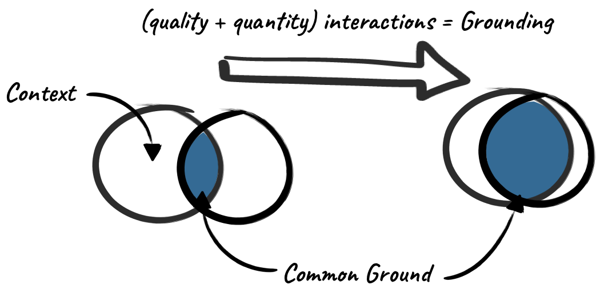

# Common Ground

## Common Ground & Grounding

When you start interacting with someone, you can assume some common ground, and this develops over time as interactions deepen. The more interactions you have with someone, the better the joint context and the more common ground you have. You can assume some common ground before an interaction, but it increases over time with further interactions and deepens the more interactions you have.

**Impact on Remote Working:** Is it harder for remote teams to achieve common ground when compared to fully colocated teams? Maybe, but if the full team embraces a different mindset, approach, tools and processes, it becomes a close-run comparison.

