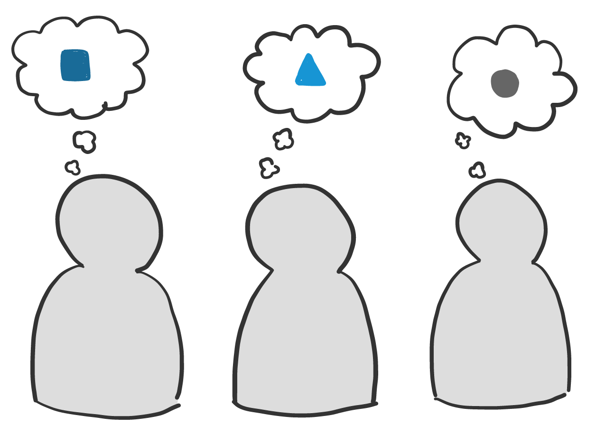

# Context


Feel free to skip the following sections \(Context, Interaction, Trust, Common ground and Agile Law\) as it musing about why, rather than thoughts on how


## Context

All information is meaningless until you provide context. We build up context based on our past experiences, where we have worked, who we socialise with and the situations we have found ourselves in. We know that working for the same organisation allows for some **specific shared context**. You might share a work environment and culture, and you can draw on this knowledge when interpreting what’s being said. However, we hold specific mental models that, though seemingly closely aligned, often have varied meanings from person to person. A term like DevOps has a wide range of definitions and just because you say the same word it doesn’t automatically imply you share the same meaning. Remember, “my” context is different than yours.

Impact on remote working: Explain yourself clearly. We have all sent an email that has been taken out of context, resulting in someone overreacting. Sometimes a pithy one-liner via Twitter isn’t the best method of communicating what you have in your head. When you are face-to-face, you can wave your hand, draw on whiteboards and see when someone doesn’t understand what you are saying. Draw your ideas using shared interactive boards like [Miro](https://miro.com/) or the tool in [Zoom](https://zoom.us). Take the extra time to explain your context, don’t use woolly terms \( /ˈwʊli/ vague or confused in expression or character, ‘woolly thinking’\) and don’t assume you are talking about the same thing!

