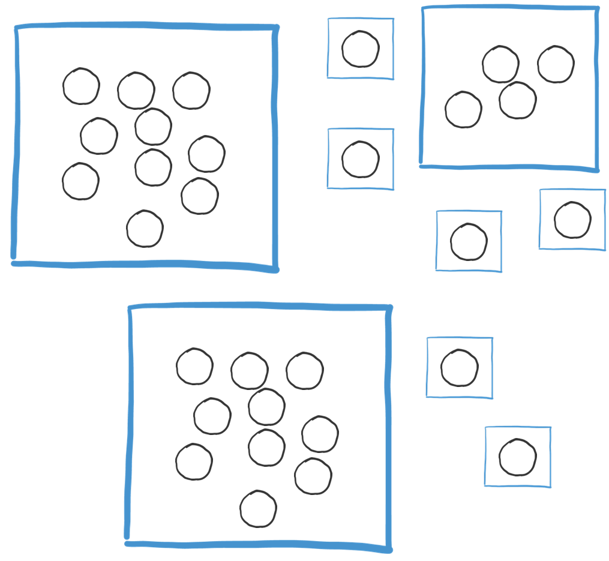

# Multiple Hubs

## Logistics

Where running multiple hubs in different locations for the same project or product, to make the delivery more effective, consider setting up the organisation like so:

**Multiple Hubs**

* **Build cross-functional teams** - Each hub has cross-functional teams located at each hub. There may be some limitations e.g. where a role only requires a single individual, the location of the product owner or there isn’t a critical mass of people, however creating fully formed teams into each hub covering role such as Delivery Leadership, QA, BA, Dev, DevOps will provide better delivery outcomes.
* **Regular Rotation** - Ensure regular rotation between each hub so people can form real relationships. Ideally rotate the location and bring more than just the Delivery Lead / Tech Lead to get full rotation around the different locations.
* **Share purpose** - Roles such as Product Owner and Sponsor should travel to different location, ideally quarterly and share 'purpose' with everyone on the team.

### **Getting some \(real\) face-time**

While video conferencing has improved substantially, it still doesn’t build team bonds like meeting face to face. When teams are distributed, arrange to meet up from time to time.

* **Kick-off new work together** - For new work coming into the team, run inceptions that are co-located, cross-functional and made up of members from across different locations.  Use this opportunity to retrospect as a team together.
* **Plan the location** - make use of the location by trying to meet where your customer is \(or where their customers are\) so that you can get a first-hand opportunity to meet and receive feedback. 
* **Team Bonding** - Take the opportunity to perform team-based activities to improve trust and increase your types of interactions. Team Bonding will only help you further to gain that common ground.

### **Multiple & Extreme Timezones**

When scaling your delivery teams around the world, think carefully about where team members are located so you can optimise your delivery. Consider how time zones can work in your favour to deliver end to end features within minimal disruption and impact on your customer.

* **Reduce the impact on the Customer -** Have a Delivery Lead, an Analyst and Tech Lead as close to the customer as possible. You want to reduce the impact on your customer of the distributed team as much as possible.
* **Cross-functional teams per Timezone** - You need cross-functional capability that can deliver its features/components to production independently of other Timezones.
* **Localise decision making** - Most implementation decisions need to happen quickly so empower the team in the Timezone to make component level decisions to prevent work from being blocked. Try and locate people working on the same components to be in the same Timezone \(App, F.E., Services\). 
* **Ensure the right access** - Ensure everyone, irrespective of their location has access to the same code base so that they can make updates if blocked.
* **Take advantage of time zones -** Organise the hubs to take advantage of time zones and location of the customer. Make your customer the centre and put the things the customer will "see" as close to them as possible \(Location / Timezone\). E.g. If your customer is in Sydney, have your Front End team as close as possible \(Australia would be best, but a similar Timezone\) and the service teams could be further afield \(Pune, San Francisco\) to enable at least a half day overlap with the FE team and the customer. 
* **Follow the sun with your communication** - If you have teams in three time zones, then use the sun to direct the travel of your communications. 
* **Avoid Extremes** - Try and avoid extreme timezones \(more than seven hours\) as full team communications becomes to difficult.  If this isn't possible, then have a team in the middle to bridge the gap and provide continuity.

