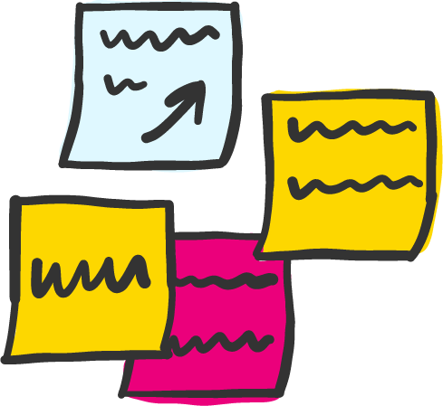

# Remote Workshops

We have been running increasingly more workshops remotely – from pre-mortems and retrospectives to inceptions and design sprints.

We have found \(so far!\) that all workshop activities can be effectively run with a remote, distributed team.  All we need to do is adjust how we design and run a remote-first approach.

This is critical because collocated teams think with their environment \(this is called distributed cognition\), and working remotely disrupts a team’s environment. In a remote setup, teams are no longer able to read subtle social cues as easily, can miss nuances in discussions and can struggle to leverage their colleagues’ energy levels to stay motivated and focused.

As a consequence of these factors, we need to adjust activities and amplify how and what we communicate in remote workshops.

## The facilitator

When running a remote workshop, the facilitator’s role changes.  There is more emphasis on the pre-workshop preparation when compared to physically co-located workshops.  On the flip side, there is less to write up at the end as the team creates the digital boards, diagrams and maps throughout the workshop.

We recommend having one facilitator \(rather than multiple\), as we have found that with two people tag-teaming, it is harder to pick up on some of the visual clues to stop, start and hand over the conversation.  You can still have other people lead sessions, but overall we recommend one facilitator.

## Preparation 

### Set up the space

One of the biggest enablers for a remote workshop is to have an effective virtual space that replaces the usual walls/whiteboards we use in person.

We tend to use [www.miro.com](http://www.miro.com/) as it offers a large canvas to work on, and it is built for collaboration.  It also has very low friction for inviting participants to collaborate. 

* On a single canvas, create a different section on the board for each activity you are planning to run.  For example, if you were running an inception, you might include a section for Vision and Goals and a separate section for the Business Model Canvas.
* Label each section clearly and provide a description of the objectives of the activity and detailed instructions on how to complete the activity.  If the section has a template, add this in as well, e.g., Business Model Canvas. Add these in order of the agenda so that there is a clear flow across the canvas, e.g., left to right.
* Add sections for capturing questions and ideas like a Parking Lot or somewhere to capture risks and issues as they are raised.  
* Add the running sheet \(agenda\) down the left-hand side with a clear narrative on why these activities have been included. 

Setting this up will make it easier for participants to understand the context as they go and has the added benefit of being set up beforehand, allowing people to work ahead of time and think about how they’ll contribute to the board.  People will often start filling things in before the session starts \(which is useful for certain activities\). 

### **Setup & Test Video Conferencing**

The most important virtual space you will use is that found in the Video conference.  Before the session ensure:

* all participants test their audio prior to joining the session
* all participants join the remote working tool with their full name
* all participants have an actual thumbnail image against their profiles \(not some random emoji or picture from high school\)

Test out Zoom's breakout room feature \(enabled by the host account\), this allows the host to create ‘side’ rooms during the workshop which may be useful if you want to hold some breakout sessions.



### Split the sessions

It is often much harder to stay focused and process what’s happening in remote workshops than in person.  

Therefore, instead of running a single long workshop, look to break it up into smaller chunks.  For example, if the workshop takes four hours when co-located, split this down into two one-hour sessions on the same day \(morning then afternoon\) followed by one two-hour session the next day.  

With a split session, leave five minutes at the end to wrap up and prepare as a team for the next session.  The facilitator needs to be explicit about when the next session starts and what is on the agenda as it’s harder to maintain momentum with split sessions.  

Another activity which is harder to do remotely is to have breakout sessions; however, some tools \(like Zoom\) have a great breakout feature.  Make sure you assign people to groups before the workshop as it’s pretty chaotic trying to get teams to form over a video conference. 

### Before the workshop

* Prepare the board and create the visual narrative of the overall workshop.  Then provide access to the participants! 
* Get everyone to test their access to the virtual tools before the meeting starts, e.g., the virtual board \(above\), video conference tool and task management tool \(if you are using one\).  We often get teams to join the call five minutes early to make sure we can start on time.
* Send clear join-in details before the meeting outlining the above.  

## During the workshop

* As a participant, to avoid distractions, take yourself away from your day job.  Turn off notifications on your devices and consider removing yourself physically from your usual environment \(e.g., find a private room or work from home\).  
* Make sure people attend on time as it’s hard to get people up to speed.  
* Although it feels counter-intuitive, using the [1-remote-all-remote rule](https://link.medium.com/rJ9s20EhK4) equalises the power imbalances we often see in remote-friendly teams.  An alternative approach is to have one facilitator in each room of attendees however this approach has different challenges e.g., requiring the facilitators to have an ongoing private conversation throughout the workshop.
* Enforce basic remote-first working etiquette: mute by default, turn the video on etc . . .
* Focus on being efficient with the digital board: rather than raising duplicate post-its, either enhance or upvote an existing post-it.

## After the workshop

* Get individual team members to playback directly to their stakeholder groups using digital boards, maps, and documents that were created during the workshop.  No need to wait for a playback deck!

## Challenges of running a remote workshop

* The biggest challenges are often around working with people who are not used to working together remotely.  If needed, take regular timeouts to remind the team about remote working etiquette and agree to some practices as a team.  Explaining the rationale behind practices and activities, and allowing time for the team to familiarise themselves with the online tools has generally resulted in greater buy-in, in our experience.
* It can be harder to know whether the attendees have understood and internalised discussions, therefore regularly stress-testing the team’s collective buyin and understanding is very helpful. We achieve this by updating the digital board and asking open questions to confirm we are aligned. 
* Some find it hard because they like to talk \(read: ramble\), and there is less tolerance for this in remote sessions.  Acknowledge this and allow for break-out sessions or “discussion time” between workshop sessions.
* Secondary objectives, such as building trust and bonding as a team, are more difficult to achieve during these sessions.  Acknowledge this upfront and optionally plan the time for remote-friendly ice-breakers and trust-building exercises.
* Given it is harder to have casual “side conversations”, setup an open and/or anonymous chat channel so attendees can raise thoughts and concerns as they are going through workshop sessions.

