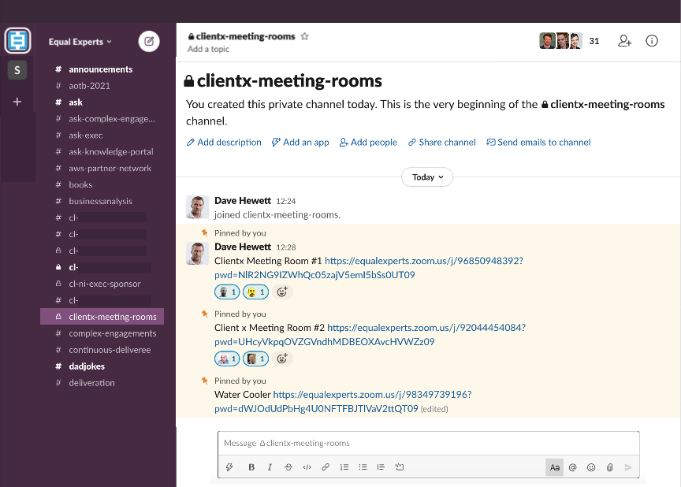

# Virtual Team Meeting Rooms

Signally availability of your team members is important in a remote-first world.  You can’t just look over at someone's desk and see if they are there or if they are in deep work with a “DO NOT DISTURB” face.  Using the status on Slack can solve part of the problem, but that only really saying when you are not available, “In a meeting” or “Out sick”, but it doesn’t work as well for "I want to pair" or even "fancy a coffee". 

TLDR: create a dedicated slack channel, put in some "enduring" zoom links, when you are on the zoom call then add your emoji so others can see and join.  

#### Set it up:

* Setup a new slack team-based slack channel which is dedicated to the task e.g. \#clientx-meeting-rooms.  Do not use this channel for anything other than adding the room details 
* Create team slack Emoji’s, one for each team member preferably with a real photo and name.  
* With a pro zoom licence, create a small number of ‘Enduring Meetings Links’. Schedule a meeting in zoom and create a recurring meeting \(Recurrence = No Fixed Time\).
* Add these links to the channel and label their purpose. E.g. meeting room, watercooler

#### Running it:

* If you join a meeting link then add your emoji
* If you leave a meeting link then remove your emoji 
* Rooms are available on a first-come-first-serve basis
* Try “Hey are you free, I’m in clientx meeting room\#1 with Sarah to chat about this, can you join now”?  

This has been tried and tested with the CondéNast project with significant success, where it has helped to bring back some of the feeling of being co-located but in a remote way. 

